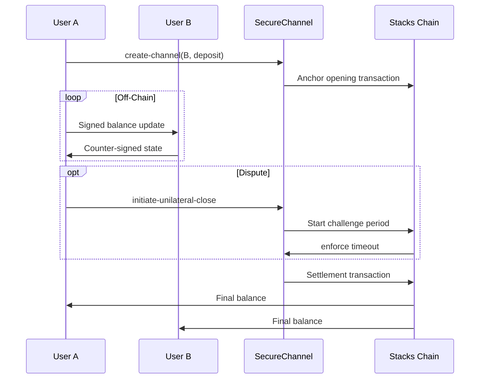

# SecureChannel - Bitcoin-Compatible Payment Channels for Stacks

A trustless payment channel implementation enabling high-frequency, low-cost transactions on Stacks blockchain with Bitcoin settlement guarantees.

## Features

- 🛡️ **Bi-directional Payment Channels**  
  Establish secure channels between two parties with STX deposits
- ⚡ **Instant Off-Chain Transactions**  
  Conduct unlimited microtransactions without blockchain fees
- 🔒 **Non-Custodial Security**  
  Maintain full control of funds with cryptographic guarantees
- ⏳ **Dispute Resolution System**  
  7-day challenge period for fair settlements
- 📜 **Satoshi-Style Scripting**  
  Compatible with Bitcoin transaction principles

## Installation

### Prerequisites
- [Clarinet](https://docs.hiro.so/clarinet) v2.0+
- Node.js 18.x
- Stacks.js libraries

```bash
git clone https://github.com/yourorg/securechannel.git
cd securechannel
npm install
```

## Usage

### Channel Lifecycle Management

#### 1. Create New Channel
```clarity
(contract-call? .securechannel create-channel 0x1234abcd 'SP3BZ... 1000000)
```
- `channel-id`: 32-byte unique identifier
- `participant-b`: Counterparty STX address
- `initial-deposit`: Initial STX amount (minimum 1 STX)

#### 2. Fund Existing Channel
```clarity
(contract-call? .securechannel fund-channel 0x1234abcd 'SP3BZ... 500000)
```

#### 3. Cooperative Closure
```clarity
(contract-call? .securechannel close-channel-cooperative 
  0x1234abcd 
  'SP3BZ... 
  1200000 
  300000 
  0xsignatureA 
  0xsignatureB
)
```

#### 4. Dispute Initiation
```clarity
(contract-call? .securechannel initiate-unilateral-close
  0x1234abcd
  'SP3BZ...
  1500000
  0
  0xsignature
)
```

## Architecture



## Security Model

### Key Protections
- **Signature Verification**  
  All state transitions require dual signatures
- **Anti-Replay Nonces**  
  Sequential nonce system prevents state rollbacks
- **Dispute Timeout**  
  1008-block (≈7 day) challenge period for disputes
- **Balance Validation**  
  Strict checks ensure Σ(balances) = total deposit

### Error Handling
| Code | Error                  | Description                     |
|------|------------------------|---------------------------------|
| 100  | Not Authorized         | Invalid permissions            |
| 101  | Channel Exists         | Duplicate channel ID           |
| 102  | Channel Not Found      | Invalid channel identifier     |
| 103  | Insufficient Funds     | Balance mismatch               |
| 104  | Invalid Signature      | Cryptographic verification fail|
| 105  | Channel Closed         | Operation on closed channel    |
| 106  | Dispute Period Active  | Premature settlement attempt   |

## Advanced Features

### Custom Transaction Scripts
Create conditional payment agreements using Bitcoin-style scripts:
```clarity
(define-constant HASH-LOCK 
  (if (is-eq (sha256 tx-sender-data) 0xpreimage_hash)
    true
    false
)
```

### Fee Optimization
```clarity
(define-public (batch-update
  (updates (list 100 {channel-id: (buff 32), amount: int})
)
  ;; Process multiple channel updates in single transaction
)
```

## Audit Considerations

1. **Signature Verification**  
   Current implementation uses simplified principal matching - production systems should implement full ECDSA verification

2. **Time Lock Granularity**  
   Dispute period uses block height instead of timestamps for deterministic execution

3. **Fund Recovery**  
   Emergency withdrawal function includes 30-day timelock for contract owner

## Contributing

1. Fork repository
2. Create feature branch (`git checkout -b feature/improvement`)
3. Commit changes (`git commit -am 'Add new feature'`)
4. Push to branch (`git push origin feature/improvement`)
5. Create Pull Request
